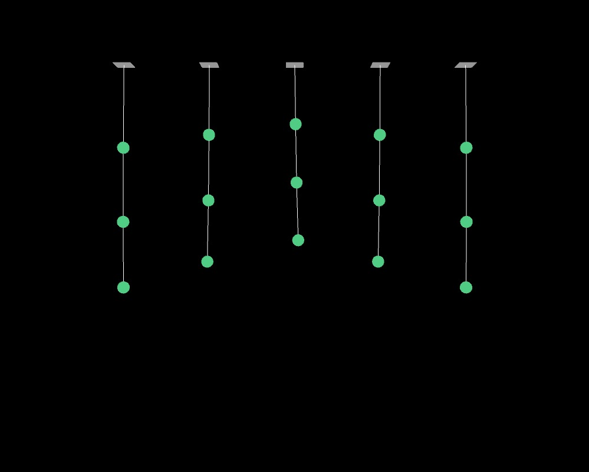

# physical-system-simulation-algorithms

## description
- Simple physical system simulation algorithms for sytems like cloth, rigid and deformable objects, shallow water.
- Cloth and deformable objects are simulated with a grid of point masses connected by springs.
- Eulerian integration and Midpoint method are used to solve force equations and get positions to animate the simulation.
- Shallow water simulation implements Lax-Wendroff method to numerically solve very simplified version of Navier-Stokes equations.
## roadmap
- Problems solved until now are listed in demonstration section.
## code
- Code is written in Java, should work with JRE 8+.
    - `src/` contains all source code.
    - `jars/` contain all libraries bundled as jars.
        - `processing` is used as a rendering library.
        - `queasy cam` is used as a camera library.
    - `data/` contains resources such as images, obj, mtl files.
## documentation
- For most of the code, the documentation is itself.
## usage
- Open a terminal at project root (the directory containing this file).
- Use `javac -cp "jars/*" -d build/ $(find -name "*.java")` to compile and put all output class files under `build/`.
- Use `java -cp "build/:jars/*" <package>.<to>.<path>.<class>` to run any simulation.
    - For example `java -cp "build/:jars/*" demos.BasicCloth`.
- Common controls
    - `w a s d` for basic camera movements.
    - `q e` for camera up and down movements.
- Tested on Ubuntu 18.04
    - If you use a distrubution that uses rolling release cycle (like Arch) you might have to install some older version of JRE and mesa (opensource intel openGL driver) that work with processing library.
## demonstration
- The title bar shows the state of the system at any instant.
- The videos demos are compiled into a [playlist](https://www.youtube.com/playlist?list=PLrz4CUP15JSI6OnuyqtFs-BR5opYcNjvx).

### Thread as serially connected spring-mass system
#### videos

- Each rope is made of a series of 3 massless-springs and 3 point-masses.
- Forces acting on each mass are:
    - Gravity.
    - Restoration force from each spring along the length of spring.
    - Dampening force from each spring along the length of spring.
- The point-masses in thread in the middle have lesser mass and hence they reach equilibrium at shorter lengths.

#### images
|  |  |  |
| --- | --- | --- |
| Initial state, released at horizontal position | Intermediate state, in motion | Equilibrium state, settled at vertical position |

### Basic cloth as a grid connected spring-mass system
#### videos

- 3D Realtime rendering.
- User-controlled first person camera.
- Texture.

### Cloth falling on sphere (1-way interaction)
#### videos

- 1-way cloth-object interaction.

### Air drag and wind effects
#### videos

- Billowing wind effect simulated with aerodynamic drag @ `0:53`.

### Sphere falling on cloth (2-way interaction)
#### videos

- The cloth shoots the sphere like a slingshot when released @ `00:20`.

### Rigid circles falling on a thread (2-way interaction)
#### videos

### Rigid spheres falling on a cloth (2-way interaction)
#### videos

### Effect of skip node springs on cloth stiffness
#### videos
| No skip nodes | Yes skip nodes |
| --- | --- |
|  |  |
| @ `00:29` (wind speed = 33) billowing waves are flattened | @ `00:25` (wind speed = 33) billowing waves are pronounced |
| @ `00:33` (wind speed = 46) more elongated and tears off | @ `00:48` (wind speed = 46) less elongated and is intact. |

### Tearable cloth
#### videos
- The sword is attached to camera's position and locked to its orientation in  ground XZ plane

- Cloth tearing due to high speed winds @ `00:38`

### Burnable cloth
- Hot ball starts fire on cloth at arbitrary points
#### videos

### Parachute shooting
- Air drag slows down the sky diver.
- A hot ball shot at parachute burns it down thus making her free fall.
#### videos

### Deformable objects
#### videos
- Falling cat

- Cutting jelly

### 1D shallow water
#### videos

### 2D shallow water
- The object used is used to display the disturbance we are creating in water columns underneath it.
- It creates vibrations (multiple disturbances) causing multiple waves.
#### videos

### Comparing integrators, Eularian vs Higher-order
- The integrator is toggled interactively (by pressing num 2) in this demo.
- The integrator used for that instant is shown in the title bar.
- Eularian integrator is faster, but less stable especially in high winds.
- Higher order integrator is slower, but more stable even in high winds.
#### videos

# Things used
- https://stackoverflow.com/a/36425155/4031302 for distance from point to line segment
